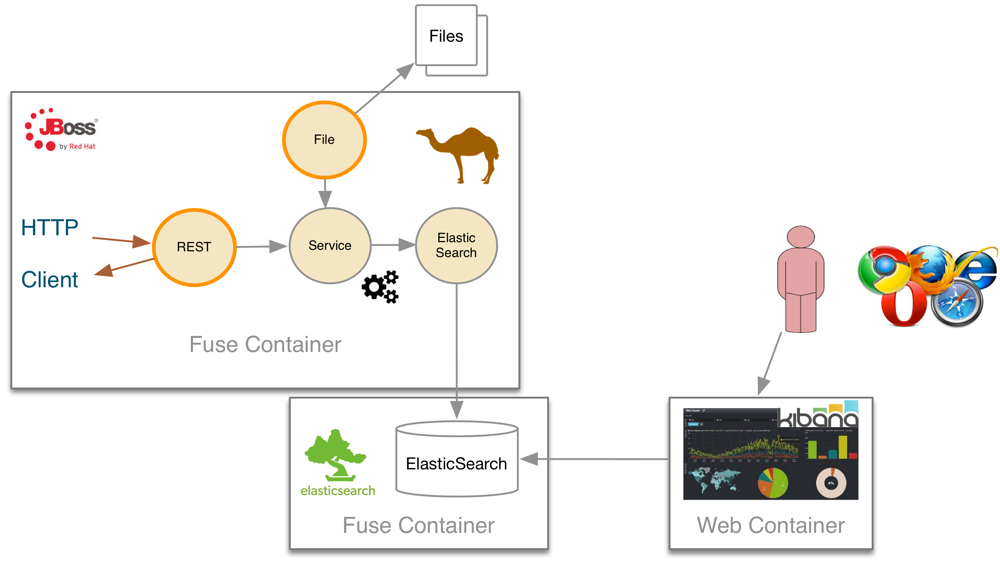

= POC IPLAN

Esse prova de conceito tem como objetivo mostrar a criação de um CRUD REST usando
o Camel para integração das rotas, assim como mostrar como o ambiente é provisionado
e mantido utilizando todo ambiente do Jboss Fuse.

Objetivos para ser validado no CRUD REST:

* Documentação de API
* Gerenciamento de erro
* Facilidade de criação
* Alteração e deploy

== Escopo

Para o passo a passo completo do setup desse exemplo, conferir a documentação: https://raw.githubusercontent.com/FuseByExample/rest-dsl-in-action

== Rotas

A tabela abaixo apresenta um sumários das rotas utilizadas

|====
| Rest URl | Operation | Route | Bean method | ElasticSearch Class Type
| /blog/article/ | PUT | AddArticleToElasticRoute | ElasticSearchService.add() | IndexRequest
| blog/article/search/user/{user} | GET | SearchArticleToElasticRoute | ElasticSearchService.getBlog() | GetResponse
| blog/article/search/id/{id} | GET | SearchArticleToElasticRoute | ElasticSearchService.getBlogs() | SearchResponse
| blog/article/{id} | DELETE | DeleteArticleToElasticRoute | ElasticSearchService.() | DeleteRequest
|====

== Instalação do fuse

  ./setup.sh

=== Automatico

  shell:source mvn:org.jboss.fuse/deployment/1.0/script/install

=== Manual

==== Cria o Fabric

  fabric:create --clean -m 127.0.0.1 -r manualip --wait-for-provisioning

==== Edita o profile para ip local

  fabric:profile-edit --pid io.fabric8.elasticsearch-insight/network.host=127.0.0.1 insight-elasticsearch.datastore

==== Cria os containers elasticsearch e iplan

  fabric:container-create-child --profile insight-elasticsearch.datastore root elasticsearch-node
  fabric:container-create-child --profile feature-camel root iplan

==== Deploy do profile iplan-fuse

Dentro do projeto *routing*

  mvn fabric8:deploy

==== Adiciona o profile iplan-fuse no container demo

  fabric:container-add-profile iplan iplan-fuse

Para remover:

  fabric:container-remove-profile iplan iplan-fuse

=== ElasticSearch data maping

  http PUT http://localhost:9200/blog
  http PUT http://localhost:9200/blog/_mapping/article < data/elasticsearch/mapping.json
  http http://localhost:9200/blog/_mapping/article

== Start Kibana

Dentro do kibana, executar:

  mvn exec:java

Acesso:

  http://localhost:9090/index.html

=== Cria o Dashboard

  http PUT http://localhost:9200/kibana-int/dashboard/fusedemo < data/elasticsearch/dashboard.json

== Popula ElasticSearch

. Insere um usuário

  http PUT http://localhost:8183/camel-rest/blog/article < data/elasticsearch/entry.json

. Procura usuário *rramalho* pelo nome

  http http://localhost:8183/camel-rest/blog/article/search/user/rramalho

. Procura usuário com id 0

  http http://localhost:8183/camel-rest/blog/article/search/id/0

. Remove usuário

  http DELETE http://localhost:8183/camel-rest/blog/article/0

=== Popular em massa

  cp routing/src/data/articles/records.csv instances/demo/articles/

== Swagger

  http://localhost:8183/hawtio-swagger

  http://localhost:8183/rest/api-docs

  {
    "id": "21",
    "user": "rramalho",
    "body": "This is a blog article",
    "title": "Title of the blog article",
    "postDate": "2016-07-18T10:10"
  }

== Failure Kibana

== Super basic

  .get("hello").id("helo").description("Hello World").route().transform().constant("Hello World");
